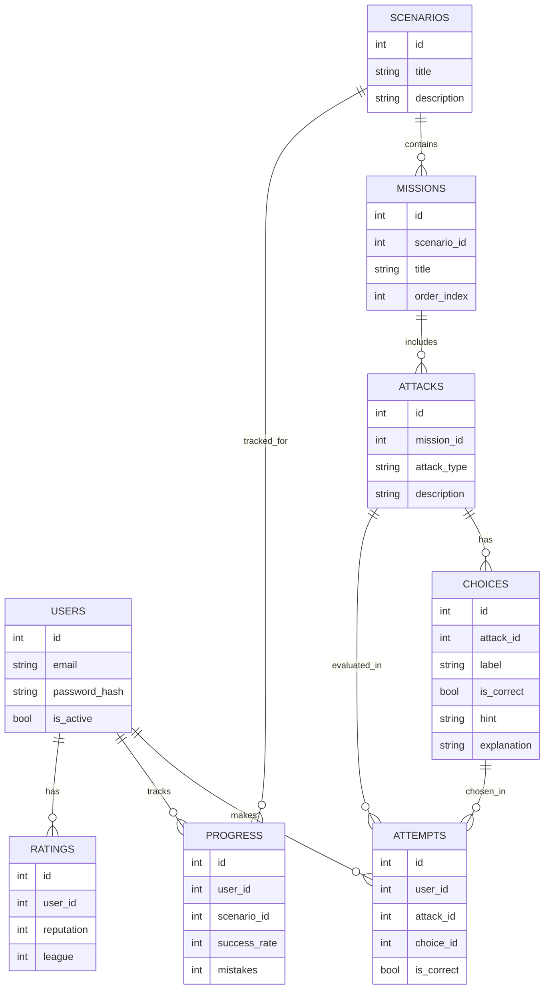

```mermaid
erDiagram
    USERS ||--o{ ATTEMPTS : makes
    USERS ||--o{ PROGRESS : tracks
    USERS ||--o{ RATINGS : has

    SCENARIOS ||--o{ MISSIONS : contains
    MISSIONS ||--o{ ATTACKS : includes
    ATTACKS ||--o{ CHOICES : has

    SCENARIOS ||--o{ PROGRESS : tracked_for
    ATTACKS ||--o{ ATTEMPTS : evaluated_in
    CHOICES ||--o{ ATTEMPTS : chosen_in

    USERS {
        int id
        string email
        string password_hash
        bool is_active
    }
    SCENARIOS {
        int id
        string title
        string description
    }
    MISSIONS {
        int id
        int scenario_id
        string title
        int order_index
    }
    ATTACKS {
        int id
        int mission_id
        string attack_type
        string description
    }
    CHOICES {
        int id
        int attack_id
        string label
        bool is_correct
        string hint
        string explanation
    }
    ATTEMPTS {
        int id
        int user_id
        int attack_id
        int choice_id
        bool is_correct
    }
    PROGRESS {
        int id
        int user_id
        int scenario_id
        int success_rate
        int mistakes
    }
    RATINGS {
        int id
        int user_id
        int reputation
        int league
    }
```
